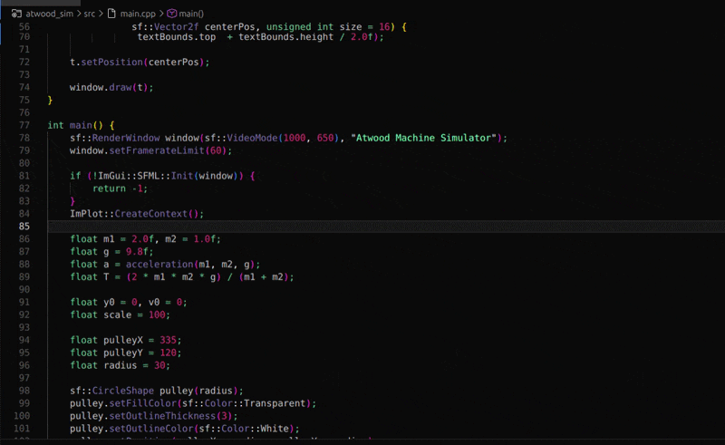
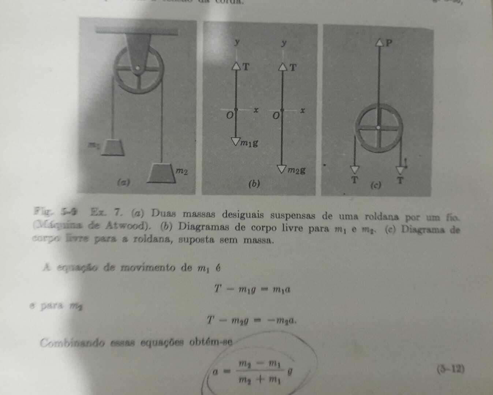

# Atwood Machine Simulator

Simulador interativo da **Máquina de Atwood**, desenvolvido em **C++** com **SFML**, **ImGui** e **ImPlot**.  
O projeto foca na modelagem matemática e na visualização em tempo real de um sistema clássico de dinâmica newtoniana.



---

##  Fundamentação Física

A Máquina de Atwood consiste em dois corpos de massas $$m_1$$ e $$m_2$$, ligados por um fio inextensível que passa por uma polia ideal (sem massa e sem atrito).

O modelo adotado assume:
- fio inextensível  
- polia ideal  
- ausência de resistência do ar  
- campo gravitacional uniforme  

---

## Forças Atuantes

Em cada bloco atuam duas forças:

### Peso

A força peso é dada por:

$$P = m g$$

- $$m$$: massa do corpo  
- $$g$$: aceleração da gravidade  

No simulador, essa força é representada por vetores verticais apontando para baixo.

---

### Tensão na Corda

A tensão $$ T $$ atua ao longo do fio, puxando os blocos para cima.

Aplicando a **Segunda Lei de Newton** em cada massa:

Para $$m_1$$:

$$ T - m_1 g = m_1 a $$


Para $$m_2$$:

$$ m_2 g - T = m_2 a $$

Somando as equações:


$$(m_2 - m_1) g = (m_1 + m_2) a$$


---

## Aceleração do Sistema

Isolando $$a$$:


$$a = \frac{(m_2 - m_1)}{(m_1 + m_2)} \, g$$

Essa é exatamente a função implementada no código:

```cpp
float a = acceleration(m1, m2, g);
```

---

## Tensão na Corda (Forma Final)
Substituindo $$a$$ em qualquer das equações:

$$ T = \frac{2m_1 m_2}{m_1 + m_2} \ g$$

Implementado diretamente no código:
```cpp
float T = (2 * m1 * m2 * g) / (m1 + m2);
```

---

## Equações Cinemáticas
Como a aceleração é constante, o simulador utiliza as equações do movimento uniformemente variado:

### Posição

$$y(t) = y_0+v_0 t + \frac{1}{2} at²$$

### Velocidade

$$ v(t) = v_0+at$$


#### Essas equações são encapsuladas na função:
```csharp 
State s = stateAt(t, y0, v0, a);
```
---

## Interpretação Física no Simulador

- Se $$m_2 > m_1$$, então: 
    - $m_2$  desce
    - $$m_1$$ sobe
- Se $$m_1 > m_2$$, o sentido se inverte.

O sinal da velocidade $$v(t)$$ determina a direção dos vetores exibidos na interface.

---

## Estrutura do Projeto

```bash
.
├── main.cpp        # Loop principal e renderização
├── physics.hpp     # Modelo físico (equações e estado)
├── media/
│   ├── demo.gif
│   └── halliday.jpg
├── Makefile
```
---

## Compilação e Execução
### Dependências

Instale a SFML:
```bash 
sudo apt install libsfml-dev
```

### Compilar 
```bash
make
```

### Executar
```bash
./Atwood
```
---

## Inspiração 


O simulador foi baseado em diagramas clássicos de livros didáticos de física, especialmente:
- Física I - 1 — Halliday - Resnick
